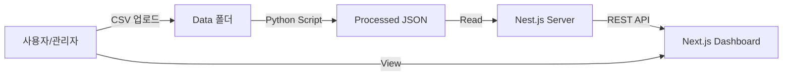

# STO 미국 법인 경영 대시보드 (STO US Corp Management Dashboard)

## 1. 프로젝트 개요 (Project Overview)
**STO 미국 법인**의 경영 성과(매출, 손익 등)를 시각화하여 모니터링할 수 있는 웹 애플리케이션입니다.
프론트엔드(Next.js)와 백엔드(Nest.js)를 분리하여 확장성 있는 구조로 개발하며, Python 스크립트로 데이터를 전처리합니다.

## 2. 기술 스택 (Tech Stack)

### Frontend
- **Framework**: Next.js (App Router)
- **Language**: TypeScript
- **Styling**: Tailwind CSS, Shadcn UI
- **Charts**: Recharts (Recommended)
- **Deployment**: Vercel

### Backend
- **Framework**: Nest.js
- **Language**: TypeScript
- **Role**: API Server (Data Provider)
- **Deployment**: Vercel (Serverless Functions) or Render/Railway

### Data Processing
- **Language**: Python (Pandas)
- **Input**: CSV/Excel files
- **Output**: JSON (consumed by Nest.js)

## 3. 시스템 아키텍처 (System Architecture)


## 4. 폴더 구조 (Directory Structure)
```bash
stodashboard/
├── frontend/          # Next.js (UI & Dashboard)
│   ├── src/
│   ├── public/
│   └── ...
├── backend/           # Nest.js (API Server)
│   ├── src/
│   └── ...
├── data/              # 데이터 저장소
│   ├── raw/           # 원본 CSV/Excel (사용자 업로드)
│   └── processed/     # 정제된 JSON (Python 출력)
├── scripts/           # Python 데이터 정제 스크립트 (ETL)
└── README.md
```

## 5. 주요 기능 (Key Features)
1. **데이터 처리 (ETL)**:
   - `data/raw` 폴더에 위치한 CSV 파일을 Python 스크립트가 읽어 분석하기 좋은 형태(`data/processed/data.json`)로 변환.
2. **API 제공 (Backend)**:
   - Nest.js가 `data.json`을 읽어 프론트엔드 요청에 따라 필터링 된 데이터를 JSON 형태로 응답.
3. **시각화 (Frontend)**:
   - **매출 대시보드**: 월별/분기별 매출 추이.
   - **손익(P&L) 대시보드**: Waterfall 차트, KPI 카드 등.

## 6. 개발 로드맵 (Development Roadmap)
- [ ] **Step 1**: 프로젝트 구조 세팅 (Frontend, Backend 폴더 생성)
- [ ] **Step 2**: Python 스크립트 작성 (CSV -> JSON 변환 로직)
- [ ] **Step 3**: Backend(Nest.js) API 구현 (데이터 조회 엔드포인트)
- [ ] **Step 4**: Frontend(Next.js) UI 구현 (Shadcn UI + Tailwind)
- [ ] **Step 5**: 데이터 연동 및 배포 설정

## 7. 시작하기 (Getting Started)

### 사전 요구사항
- Node.js (v18+)
- Python (3.8+)

### 설치 및 실행
**Frontend**
```bash
cd frontend
npm install
npm run dev
```

**Backend**
```bash
cd backend
npm install
npm run start:dev
```

**Data Processing**
```bash
# 데이터 갱신 필요 시
python scripts/process_data.py
```
